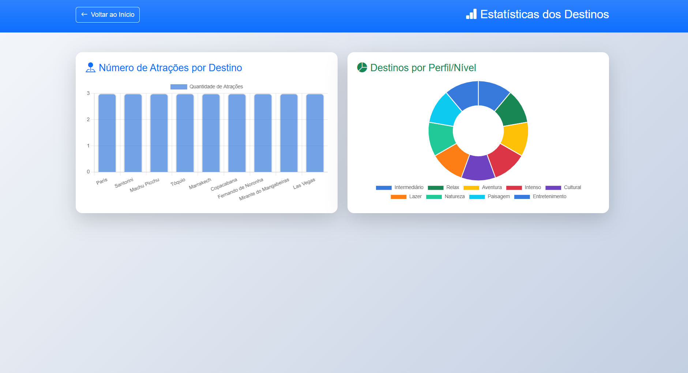

# maria_santos_1659700

nome: Maria Luiza Martins dos Santos
matricula: 923410

# Trabalho Prático 2

# aura viagens
 E| um site de turismo, nele vc encontra informaçoes de diversos destinos

 ### 2. Gráficos Estatísticos Dinâmicos (Chart.js)
 Gráfico de Barras (Atrações por Destino):
  Exibe de forma comparativa a quantidade exata de pontos turísticos cadastrados em cada um dos locais.
Gráfico Donut (Distribuição por Níveis/Perfis):
 Realiza o agrupamento em tempo real dos destinos com base no perfil da viagem (Cultural, Lazer, Natureza, Paisagem, Entretenimento), distribuindo os dados em uma paleta de cores estendida para evitar repetições.

 ### prints:

